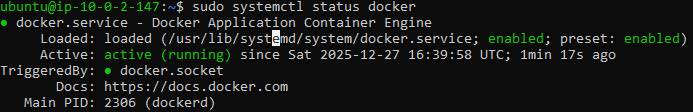
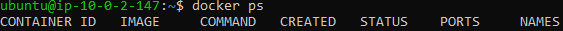
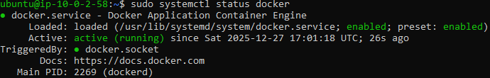

Vul onderstaande aan met de antwoorden op de vragen uit de readme.md file. Wil je de oplossingen file van opmaak voorzien? Gebruik dan [deze link](https://github.com/adam-p/markdown-here/wiki/Markdown-Cheatsheet) om informatie te krijgen over
opmaak met Markdown.

a)Het commando: "sudo usermod -aG docker ubuntu" word gebruikt om de ubuntu gebruiker rechten te geven zonder dat hij sudo moet gebruiken.

b)

# Testserver
Screenshot voor installed docker

Rechten gegeven voor de ubuntu gebruiker zodat hij "docker ps" kan gebruiken zonder sudo

# Productionserver
Screenshot voor installed docker

Rechten gegeven voor de ubuntu gebruiker zodat hij "docker ps" kan gebruiken zonder sudo
